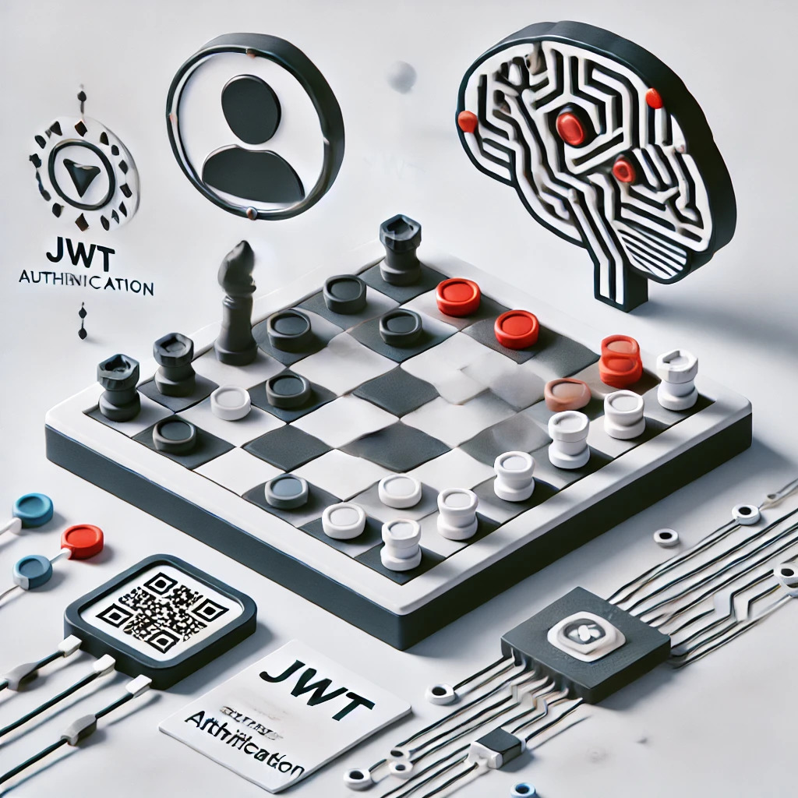

# 👨🏻‍💻Sviluppo di un sistema backend per la gestione delle partite di dama: progetto per il corso di Programmazione Avanzata
<div align="center">
  
</div>


        
<!--  -->


<hr />

Il seguente progetto è stato sviluppato come parte dell’esame di **Programmazione Avanzata** (A.A. 2023/2024) presso l'**Università Politecnica delle Marche**, all’interno del corso di Laurea Magistrale in Ingegneria Informatica e dell’Automazione (LM-32). Il sistema realizzato è un back-end che permette la gestione delle partite di dama in TypeScript utilizzando Node.js, Express, Sequelize e la libreria rapid-draughts per la logica del gioco.

L’idea alla base del progetto è che, gli utenti (autenticati tramite token JWT) possano giocare contro altri utenti o contro l’intelligenza artificiale (IA), con la possibilità di scegliere tra diversi livelli di difficoltà. Il sistema è stato sviluppato per gestire partite multiple, permettendo agli utenti di creare una nuova partita convalidando l’idoneità della richiesta, scalando i token necessari sia per la creazione della partita che per ogni mossa successiva. Il progetto integra un sistema di abbandono e vittoria, con un sistema di punti per i giocatori e prevede la possibilità di esportare lo storico delle mosse in formato JSON o PDF.

Il progetto è stato interamente concepito e realizzato da **Simone Recinelli** e **Diego Santarelli**. Entrambi gli autori hanno collaborato attivamente in tutte le fasi di sviluppo, dalla progettazione iniziale dell’architettura del sistema, alla scrittura del codice, fino all’integrazione dei diversi componenti e alla fase di testing. La sinergia tra i due ha permesso di affrontare e risolvere problematiche complesse legate alla gestione delle partite e all’ottimizzazione delle prestazioni del sistema. Il contributo di entrambi ha garantito la creazione di un progetto solido e ben strutturato, rispettando gli obiettivi e i requisiti del progetto richiesto dal **Prof. Mancini Adriano**.
# 👆🏼Indice
- [Obiettivi di progetto](#obiettivi-di-progetto)
- [Progettazione](#progettazione)
     - [Diagramma dei casi d'uso](#diagramma-dei-casi-duso)

## 🏁 Obiettivi di progetto
Come scritto precedentemente, l'obiettivo principale è realizzare un sistema di back-end per la gestione delle partite di dama.
Per raggiungere tale scopo, questo va diviso in funzionalità da realizzare:
- _Autenticazione dell'utente_ mediante token JWT, per la quale è prevista una rotta di login. Il login viene effettuato tramite l'email dell'utente e la sua password. 
- _Creazione di partite_ nelle quali l'utente può giocare contro altri utenti o contro l'intelligenza artificiale (IA), con la possibilità di scegliere tra diversi livelli di difficoltà, utilizzando la libreria [rapid-draughts](https://github.com/loks0n/rapid-draughts).
- _Validazione della richiesta di creazione della partita_, in quanto ogni utente autenticato possiede un numero di token necessari per la creazione della partita e per effettuare mosse all'interno di essa; in particolare:
    - Ad ogni utente vengono detratti 0.45 token all’atto della creazione.
    - Ad ogni mossa, vengono detratti 0.0125 token (anche per le mosse effettuate dall'IA).
    - Se il credito scende sotto zero, l'utente può continuare la partita ma non può crearne di nuove fino alla ricarica.
- _Esecuzione di una mossa_ per la quale deve essere verificato se questa sia ammissibile o meno.
- _Verifica delle partite svolte_ da un utente, filtrando opzionalmente per la data di inizio di una partita, per ognuna delle quali occorre riportare:
    - Se la partita è stata vinta o persa.
    - Il numero totale di mosse.
- _Valutazione dello stato di una partita_, che si considera chiusa quando:
    - Un utente/AI vince (se l'utente vince guadagna 1 punto).
    - L'utente abbandona (esso perde 0.5 punti).
- _Storico delle mosse_ di una data partita con la possibilità di esportare in formato JSON o PDF.
- _Classifica dei giocatori_ dando la possibilità di scegliere l’ordinamento ascendente/discendente. Questa, rispetto alle altre, è una rotta non protetta accessibile anche dagli utenti non autenticati.
- _Ottenimento di un certificato_ in formato PDF che che attesti la vittoria in una data partita; il certificato deve contenere il tempo impiegato per vincere la partita, il numero di mosse totali (dei due utenti) ed il nome dell’avversario.

## 🛠 Progettazione
La progettazione di un sistema software ben strutturato richiede una suddivisione ordinata delle componenti principali del progetto. Nel nostro caso, l’architettura è stata organizzata in modo tale da favorire la manutenibilità, la scalabilità e la chiarezza del codice. Ogni componente ha una responsabilità specifica, contribuendo al corretto funzionamento dell’intero sistema.

L’organizzazione delle directory del nostro progetto segue una suddivisione logica che consente una gestione chiara di file e moduli. Ogni directory contiene file relativi a un aspetto particolare dell’applicazione, permettendo una gestione modulare e separata del codice. Questa struttura facilita la collaborazione tra sviluppatori, semplifica l’estensione del progetto e garantisce un facile accesso a specifiche funzionalità.

Di seguito viene riportata la struttura delle directory:
```
checkers_pa/
├── images/
├── src/
│   ├── controllers/
│   ├── database/
│   ├── helpers/
│   ├── middleware/
│   ├── models/
│   ├── routes/
│   └── services/
│       └── app.ts
│       └── boardConfiguration.json
│       └── express.d.ts
│       └── global.d.ts
├── .dockerignore
├── .env
├── .gitignore
├── docker-compose.yml
├── Dockerfile
├── LICENSE
├── package.json
├── package-lock.json
├── README.md
└── tsconfig.json
```

### 🏛️Architettura dei servizi

Il sistema di gestione delle partite di dama sviluppato in questo progetto utilizza una struttura a client-server, dove il server, implementato con Node.js e Express, funge da back-end. Il server gestisce tutte le operazioni relative all’autenticazione degli utenti, alla gestione delle partite, all’esecuzione delle mosse e all’interazione con l’intelligenza artificiale (IA). Per la logica del gioco, è stata utilizzata la libreria rapid-draughts, che garantisce un motore di gioco performante grazie alla sua implementazione con bitboards, offrendo così un’esperienza di gioco veloce e ottimizzata.

#### Componenti principali

1.	Server (Node.js con Express)
Il server riceve e gestisce le richieste degli utenti tramite API REST. Gli utenti possono autenticarsi, creare partite, eseguire mosse e visualizzare lo storico delle partite. Tutte le interazioni sono protette da un sistema di autenticazione basato su token JWT, che garantisce che solo gli utenti autorizzati possano accedere alle funzionalità protette.
2.	Database (PostgreSQL)
La persistenza dei dati viene gestita tramite un database PostgreSQL, interfacciato con il server tramite l’ORM Sequelize. Le principali entità memorizzate includono:
•	Giocatori: che mantengono informazioni sugli utenti registrati, il loro saldo di token e il loro punteggio.
•	Partite: che registrano lo stato delle partite, i partecipanti, il vincitore e il numero di mosse effettuate.
•	Mosse: che memorizzano ogni singola mossa effettuata durante una partita, con i dettagli sulla posizione e sul giocatore che l’ha eseguita.
3.	Autenticazione tramite JWT
Gli utenti si autenticano tramite JSON Web Tokens (JWT), ottenuti tramite il login con email e password. Il token JWT viene poi utilizzato per ogni richiesta successiva, permettendo al sistema di riconoscere e autorizzare gli utenti senza dover richiedere nuovamente le credenziali.
4.	Intelligenza Artificiale (AI)
Gli utenti possono giocare contro un’intelligenza artificiale (IA) che utilizza la libreria rapid-draughts, una libreria veloce e performante per la gestione del gioco della dama. Questa libreria offre diverse strategie per l’IA, tra cui una strategia casuale (Random Strategy) e una più avanzata basata sull’algoritmo AlphaBeta, configurabile in base alla profondità di ricerca desiderata. Le partite contro l’IA possono essere personalizzate scegliendo tra vari livelli di difficoltà.
5.	Libreria rapid-draughts
rapid-draughts è una libreria scritta in TypeScript progettata per offrire un motore di gioco rapido e convalidato per il gioco della dama. Utilizza una rappresentazione della scacchiera tramite bitboards, che consente una generazione rapida delle mosse e un uso minimo della memoria. Le principali caratteristiche della libreria includono:
•	La gestione dello stato della scacchiera tramite un array 1D di caselle valide.
•	Il supporto per il tracciamento della cronologia delle mosse.
•	L’integrazione di strategie di IA, tra cui la strategia Random e la strategia AlphaBeta.
•	La possibilità di effettuare mosse e aggiornare lo stato della partita in modo efficiente.
Esempio di utilizzo della libreria:

```typescript
import { EnglishDraughts as Draughts } from 'rapid-draughts/english';

const draughts = Draughts.setup();
const moves = draughts.moves;  // Ottenere le mosse legali
draughts.move(moves[0]);       // Effettuare una mossa
```
#### Interazione tra i componenti

Il sistema è basato su un’architettura a livelli, che semplifica l’interazione tra i diversi componenti. Le richieste inviate dagli utenti vengono elaborate nel seguente modo:

	1.	Autenticazione: il sistema verifica il token JWT per autenticare l’utente.
	2.	Gestione delle partite: l’utente può creare nuove partite contro altri utenti o contro l’IA, con la gestione delle difficoltà configurabili.
	3.	Esecuzione delle mosse: il sistema valida ogni mossa, assicurandosi che sia conforme alle regole di gioco, e aggiorna lo stato della scacchiera e delle partite.
	4.	IA: se l’utente gioca contro l’IA, il sistema chiama la strategia selezionata (casuale o AlphaBeta) per eseguire le mosse dell’IA.

### 📊 Diagramma dei casi d'uso

Il diagramma dei casi d’uso è uno strumento fondamentale per la rappresentazione delle interazioni tra gli utenti (attori) e il sistema. Nel contesto di questo progetto, i casi d’uso rappresentano le funzionalità principali che il sistema offre agli utenti, evidenziando le azioni che possono essere compiute all’interno del sistema di gestione delle partite di dama.

Il diagramma dei casi d’uso permette di avere una visione ad alto livello delle operazioni che gli utenti possono effettuare, come ad esempio:

### 📁 Diagramma E-R

Il diagramma E-R (Entity-Relationship) rappresenta una visione concettuale del database, mostrando le entità coinvolte e le relazioni tra di esse. In questo progetto, il diagramma E-R è stato utilizzato per modellare le entità principali coinvolte nella gestione delle partite di dama, come i giocatori, le partite, le mosse e l’intelligenza artificiale. Ogni entità è stata progettata con specifiche proprietà e regole, garantendo un’adeguata gestione dei dati e una chiara rappresentazione delle interazioni tra i vari componenti del sistema.

L’obiettivo del diagramma è illustrare in maniera chiara e sintetica come le informazioni vengono organizzate e come le entità interagiscono tra loro. Ad esempio:

### 🧱 Pattern utilizzati

Nel progetto sono stati applicati diversi pattern architetturali e design pattern per garantire una struttura flessibile, manutenibile e facilmente estendibile. I pattern utilizzati verranno elencati di seguito.

#### Model-View-Controller (MVC)

Il pattern Model-View-Controller (MVC) è un’architettura ampiamente utilizzata per separare le responsabilità all’interno dell’applicazione. In questo progetto, è stato implementato con una particolare attenzione alla gestione dei dati e delle interazioni tra utenti e sistema, ma senza una vera componente View, in quanto il progetto è un backend. Nel contesto di questo sistema, la struttura MVC è la seguente:

	•	Model: Implementato attraverso Sequelize, un ORM che mappa gli oggetti del database in modelli JavaScript/TypeScript. I modelli definiscono le entità come Giocatore, Partita, Mossa, che rappresentano i dati e contengono la logica di gestione del database. I modelli sono il cuore del livello dati, gestiscono lo stato e riflettono la struttura del database.
	•	Controller: I controller si occupano di gestire le richieste HTTP e coordinare la logica del servizio. Essi fungono da intermediari tra i modelli e i servizi. In questo progetto, ogni controller invoca le operazioni sui servizi per eseguire la logica aziendale, ricevere i dati e restituire le risposte appropriate. Ad esempio, il moveController gestisce l’esecuzione delle mosse e l’interazione con il servizio delle mosse.
	•	Service: Anche se non c’è una componente View, la logica è spostata sui Service che incapsulano le operazioni business-critical. I servizi lavorano a stretto contatto con i modelli per eseguire operazioni come la creazione di partite, l’esecuzione di mosse, la gestione del punteggio, ecc.

#### Data Access Object (DAO)

Il pattern Data Access Object (DAO) è stato implementato utilizzando Sequelize, che fornisce un’interfaccia per l’accesso ai dati. Questo pattern permette di astrarre e isolare la logica di accesso al database dal resto dell’applicazione. Sequelize agisce come il DAO, poiché gestisce tutte le operazioni CRUD (Create, Read, Update, Delete) per i modelli. Il vantaggio dell’utilizzo del DAO è la modularità e la facilità di sostituzione o aggiornamento della logica di accesso ai dati senza influenzare la logica di business. Ogni modello di dati ha le sue operazioni CRUD ben definite tramite i metodi di Sequelize.

#### Chain of Responsibility (COR)

Il pattern Chain of Responsibility (COR) è utilizzato attraverso i middleware di Express.js. Ogni middleware gestisce una fase specifica della pipeline delle richieste HTTP, permettendo un flusso organizzato e modulare. Le richieste passano attraverso una catena di middleware che validano, autenticano e infine gestiscono l’errore o restituiscono la risposta.

Alcuni esempi concreti di middleware implementati includono:

	•	Middleware di autenticazione: Verifica che un utente sia autenticato tramite un token JWT. Se l’utente non è autenticato, la catena viene interrotta e viene restituito un errore.
	•	Middleware di validazione: Verifica che i parametri della richiesta siano validi prima di procedere. Se la richiesta è invalida, il middleware restituisce una risposta di errore.
	•	Middleware di gestione degli errori: Cattura gli errori lungo la catena e restituisce una risposta d’errore formattata.

Questo pattern assicura che ogni richiesta sia gestita in modo efficiente e modulare, permettendo l’aggiunta o la rimozione di funzionalità senza modificare il core dell’applicazione.

#### Factory

Il pattern Factory viene utilizzato per gestire la creazione di errori personalizzati all’interno del progetto. La classe errorFactory, all’interno del file errorHandler.ts, genera istanze di errori personalizzati in base al contesto, permettendo una gestione centralizzata degli errori. Questo approccio rende il codice più pulito e facilita l’estensione del sistema di gestione degli errori, evitando ripetizioni e centralizzando la logica di creazione degli errori.

L’uso della Factory consente di:

	•	Creare errori con messaggi personalizzati basati sul tipo di eccezione.
	•	Integrare facilmente i codici di stato HTTP tramite la libreria http-status-codes, fornendo una gestione uniforme degli errori.

#### Singleton

Il pattern Singleton è stato implementato per gestire la connessione al database. L’istanza di Sequelize, che gestisce tutte le interazioni con il database, viene creata una sola volta durante l’inizializzazione dell’applicazione. Questo assicura che ci sia una singola fonte di connessione al database condivisa tra tutte le componenti, evitando problemi di concorrenza o conflitti di connessione. L’utilizzo di un Singleton per la connessione al database migliora l’efficienza e la coerenza delle operazioni di lettura e scrittura sui dati.


### 🔁 Diagrammi delle sequenze
